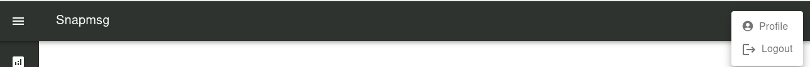
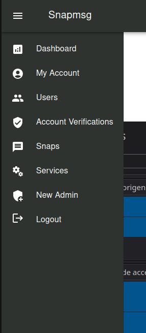

# Backoffice

## Índice
- [Backoffice](#backoffice)
  - [Índice](#índice)
  - [General ](#general-)
  - [Login](#login)
  - [Layout](#layout)
    - [Navbar](#navbar)
    - [Sidebar](#sidebar)
  - [Dashboards](#dashboards)

## General 
Para acceder al portal de administradores de SnapMsg se debe dar acceso a través del meta administrador. Este le indicará a su dirección de email el acceso a la [plataforma](https://7552-snapmsg-backoffice.vercel.app/l)

## Login
El acceso a la platforma iniciará con la siguiente vista donde se deberá introducir los datos.

## Layout

La plataforma de administrador provee una layout compuesta por 3 elementos importantes

- Navbar
- Sidebar
- Contenido

### Navbar
En la parte superior se podra visualizar con la navbar, en la cual se permitirá desplegar la sidebar con todas las acciones posibles del administrador y también podra visualizar acceder a su cuenta y desloguearse de la herramienta.

### Sidebar

Desde la sidebar se podrán acceder a todas las acciones que pueden realizar los administradores

&nbsp;&nbsp;&nbsp;&nbsp;&nbsp;&nbsp;&nbsp;&nbsp;&nbsp;&nbsp;&nbsp;&nbsp;&nbsp;&nbsp;&nbsp;&nbsp;&nbsp;&nbsp;&nbsp;&nbsp;

## Dashboards

Una vez ingresada a la plataforma se podrán acceder a los dashboards de usuarios y contenido (snaps)